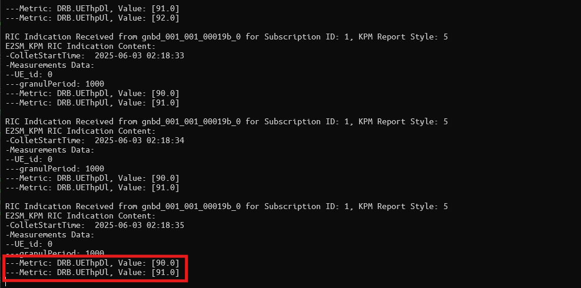

# OSC RIC

The `aether-oscric` repository helps to deploy the OSC-RIC as part of OnRamp.

To download the 'aether-oscric' repository, use the following command:
```
git clone https://github.com/opennetworkinglab/aether-oscric.git
```

This blueprint relies on srsRAN's "OSC SC RIC in Docker" (https://github.com/srsran/oran-sc-ric.git),
which provides the `i-release` of O-RAN Software Community (SC) Near-Real-time RIC.

Docker Compose is used for the deployment and the RIC includes a few simple
xApps that can help to validate exchange of data between the RIC and the RAN
using the KPM or RC service models.

For example, to launch a KPMMON xAPP, the following command can be executed in
the machine where the RIC is running/deployed:

```bash
docker exec -ti python_xapp_runner ./kpm_mon_xapp.py --metrics=DRB.UEThpDl,DRB.UEThpUl --kpm_report_style=5
```

This version of the OSC RIC has been tested with srsRAN. Below is a screen
capture of the collected metrics based on the above command.


